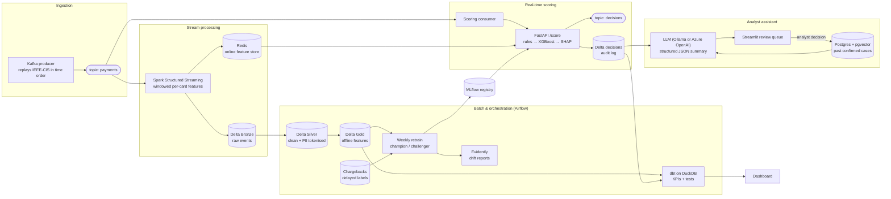
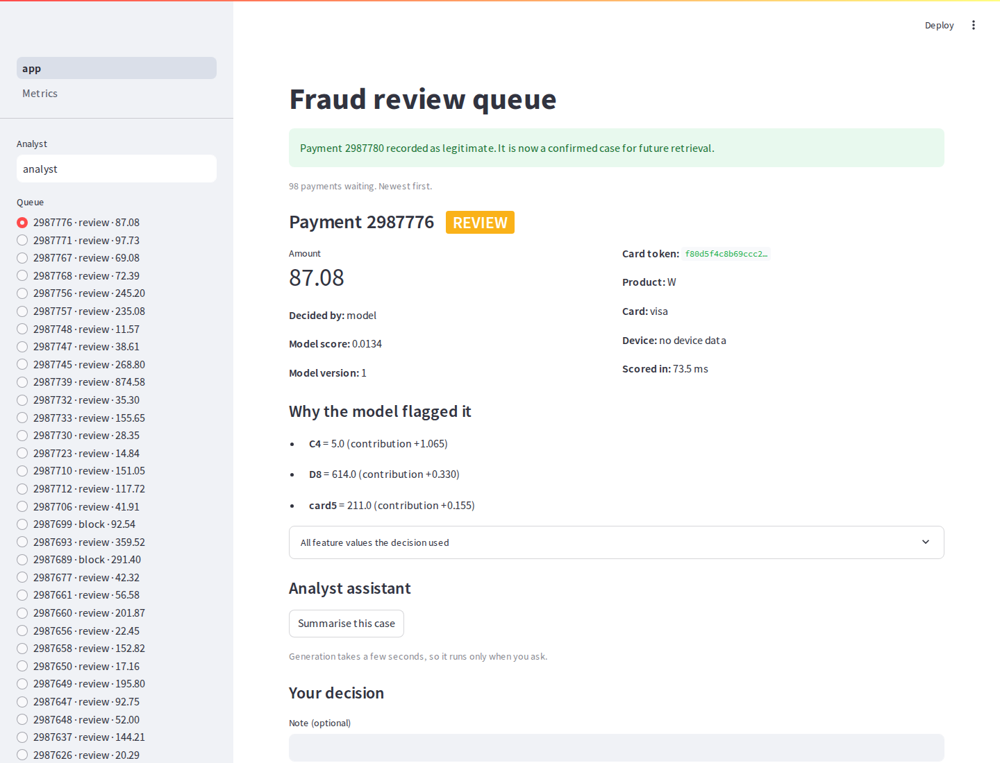
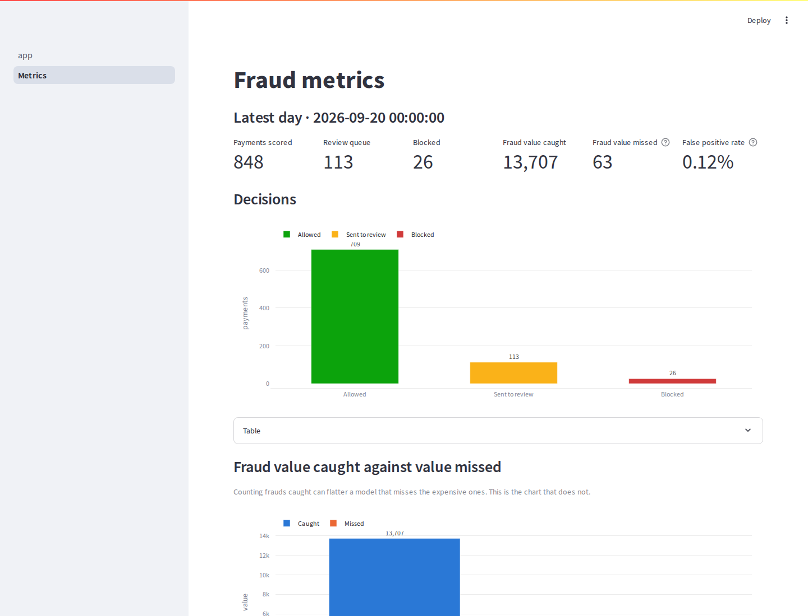

# Real-Time Payment Fraud Detection Platform

Payments stream in through Kafka, live behavioural features are computed with Spark Structured
Streaming and cached in Redis, and a FastAPI service combines a rules engine with an XGBoost model
to return **allow / review / block**. Flagged payments go to a Streamlit review queue where a local
LLM writes a grounded case summary using retrieval over past confirmed cases. Delayed chargeback
labels feed scheduled retraining, drift monitoring and dashboards. Everything runs locally, for
free, with `docker compose up`.

> **Status: all 10 phases complete.** [PROGRESS.md](PROGRESS.md) records exactly what has been
> run, what it produced, and what has not been verified. The results table below is *generated*
> from measurement files — rows that say *not yet measured* have not been measured.

---

## Architecture



Full walkthrough: [docs/architecture.md](docs/architecture.md).
Why each piece was chosen: [docs/design_decisions.md](docs/design_decisions.md).
The concepts in plain English, with likely interview questions:
[docs/interview_notes.md](docs/interview_notes.md).

---

## Quick start

### Prerequisites

| Requirement | Notes |
|---|---|
| Docker Desktop / Engine | Allocate **at least 8 GB** of RAM to Docker |
| Python 3.11 | For the host-side tooling (`make install`) |
| Java 17 | Only needed to run the Spark jobs outside Docker |
| Kaggle account | Only needed for the real dataset (see below) |

```bash
make env        # create .env from .env.example
make install    # create .venv and install dev + ml dependencies
make test       # run the test suite (no Docker, no dataset needed)
make up         # start kafka, redis, mlflow and the scoring API
```

Then open the API at <http://localhost:8000/docs> and MLflow at <http://localhost:5000>.
`make down` stops everything.

### Send some payments through it

```bash
make produce ARGS="--limit 2000"   # replay transactions onto the Kafka topic
make stream-logs                   # watch Spark land them in Bronze Delta
make bronze-peek                   # row counts, card counts, time range
```

Then build the batch layers and train a model:

```bash
make features                      # Bronze -> Silver (tokenised) -> Gold (offline features)
make quality                       # Great Expectations suite -> reports/quality_silver.json
make labels                        # chargebacks, with their real arrival delay
make dataset                       # point-in-time training set
make train                         # -> reports/metrics.json, reports/thresholds.json
```

Then build the warehouse and the dashboards' data:

```bash
make warehouse                     # export -> dbt build (7 models, 33 tests) -> drift report
make airflow                       # or orchestrate all of it: http://localhost:8080
```

Then open the analyst app:

```bash
make app                           # review queue + metrics at http://localhost:8501
make publish                       # read-only snapshot for dashboards + Power BI exports
```

Then score payments through the API:

```bash
make consume                       # payments topic -> POST /score
make load-test                     # -> reports/latency.json
curl -s localhost:8000/health | jq
```

`make demo-api` runs the whole scoring API with no Docker at all — fakeredis and a model trained
in-process — which is the quickest way to see a decision without setting anything up.

`make produce-preview` prints a couple of payment events without needing Docker at all — the
quickest way to see what flows through the system.

### Generate a PII salt

The Silver layer tokenises the card identity with a salted hash. The example salt is a placeholder
and the API reports `pii_salt_configured: false` until you replace it:

```bash
python -c "import secrets; print(secrets.token_hex(32))"   # paste into PII_HASH_SALT in .env
```

### Get the dataset

The IEEE-CIS Fraud Detection dataset is competition data and is **not** committed to this
repository. You need to accept the competition rules and use your own API token:

1. Accept the rules at <https://www.kaggle.com/competitions/ieee-fraud-detection/rules>
2. Create a token at <https://www.kaggle.com/settings> and save it to `~/.kaggle/kaggle.json`
3. `make data`

Or download the ZIP by hand and unzip `train_transaction.csv` and `train_identity.csv` into
`data/raw/`.

**You do not need the dataset to run the tests.** `tests/fixtures/` holds a committed synthetic
sample with exactly the same schema, generated by `make sample`.

### Choosing an LLM provider

The analyst assistant runs against either a local model or a hosted one. Two lines in `.env`
decide, and nothing else in the codebase changes:

```dotenv
LLM_PROVIDER=ollama                     # or azure_openai
EMBEDDING_PROVIDER=sentence_transformers # or azure_openai
```

| | Local (default) | Azure OpenAI |
|---|---|---|
| Model | `llama3.2:3b` | your chat deployment, e.g. `gpt-4o-mini` |
| Embedder | `all-MiniLM-L6-v2` (384-dim) | `text-embedding-3-small`, asked for 384-dim |
| Cost | free | **billed per token** |
| Needs | ~4.5 GB RAM for the `ollama` container | an Azure subscription and a deployed model |
| Runs offline | yes | no |

**The default stays local and free**, so a clone of this repository runs without an Azure
subscription. That is deliberate: a portfolio project that only works with someone else's paid
credentials is not a project anyone can look at.

To use Azure, copy `.env.example` to `.env` and fill in:

```dotenv
LLM_PROVIDER=azure_openai
EMBEDDING_PROVIDER=azure_openai
AZURE_OPENAI_ENDPOINT=https://<your-resource>.openai.azure.com
AZURE_OPENAI_API_KEY=<your key>
AZURE_OPENAI_CHAT_DEPLOYMENT=<your chat deployment name>
AZURE_OPENAI_EMBEDDING_DEPLOYMENT=<your embedding deployment name>
```

Then check the credentials before spending anything on a full run:

```bash
make llm-check      # one request to each configured provider
```

Three things are worth knowing before you switch:

- **`.env` is gitignored and `.env.example` holds no key.** The key is a `SecretStr`, so it does
  not appear in a settings repr, a log line or a Streamlit traceback.
- **The two providers are independent.** A hosted LLM over locally embedded cases is a valid
  combination, and is the cheaper one — embeddings are the per-case cost, summaries are only
  generated for the ~3% of payments that get flagged.
- **Changing `EMBEDDING_PROVIDER` invalidates the vector store.** Both embedders emit 384
  unit-length floats, so Postgres accepts a mixed table and cosine similarity keeps returning
  plausible numbers about nothing. The store records which embedder wrote each row and refuses
  to search a mismatched one; reload it with `make load-cases`.

### Low-memory mode

Compose profiles let you run a subset of the stack:

| Profile | Services | Approx. RAM | Command |
|---|---|---|---|
| `core` | kafka, redis, mlflow, api | ~4.0 GB | `make up` |
| `ai` | ollama, pgvector | ~4.5 GB | `make up-ai` (adds to core) |
| `hosted` | pgvector only | ~0.5 GB | `make up-ai-hosted` (for `LLM_PROVIDER=azure_openai`) |
| `orchestration` | airflow (standalone) | ~3.0 GB | `make airflow` |
| `dashboard` | superset (optional, unverified) | ~2.0 GB | `make dashboard` |

On a 16 GB laptop, `core` + `ai` is the intended maximum. Every container has an explicit
`mem_limit` in `docker-compose.yml`.

---

## Results

**Nothing here is filled in from an estimate.** This table is *generated* from the JSON files in
`reports/` by `make readme-metrics` — if a run has not produced a number, the row says *not yet
measured* rather than carrying one from memory. Each row names the command that produces it, and
the conditions it was measured under where those matter.

To fill it in with your own data: `make metrics`.

<!-- METRICS:START -->

| Metric | Value | Produced by |
|---|---|---|
| PR-AUC (test window) | *not yet measured on the real dataset* | `make train` |
| Precision at the block threshold | *not yet measured on the real dataset* | `make train` |
| Recall at the block threshold | *not yet measured on the real dataset* | `make train` |
| Recall including the review queue | *not yet measured on the real dataset* | `make train` |
| False positive rate | *not yet measured on the real dataset* | `make train` |
| Fraud value caught vs missed (test window) | *not yet measured on the real dataset* | `make train` |
| Chosen thresholds (cost-tuned) | *not yet measured on the real dataset* | `make train` |
| /score latency p50 / p95 / p99 | 12.7 / 20.3 / 21.4 ms at concurrency 1, peak 71 req/s | `make load-test` — native services (real Redis, real MLflow champion, Kafka decision sink) |
| LLM factual accuracy | *not yet measured — needs a configured LLM* | `make llm-eval` |
| LLM schema validity | *not yet measured — needs a configured LLM* | `make llm-eval` |
| Retrieval quality (same confirmed outcome) | *not yet measured — needs the real embedder* | `make llm-eval` |
| LLM latency per summary (p50) | *not yet measured — needs a configured LLM* | `make llm-eval` |
| Feature drift, recent vs reference window | 12/18 features (66.7%) | `make drift` |

<!-- METRICS:END -->

The "under 100 ms" scoring target is a **goal**, not a claim. The measured number will be published
here once `make load-test` has been run against the full stack, whatever it turns out to be.

What has been measured so far, against **real Redis, a real MLflow registry and a real Kafka
broker** (all running natively on one four-core host, not in containers): **p50 12.7 ms, p95
20.3 ms, p99 21.4 ms** unqueued, saturating at ~71 req/s in a single process. Full table and
conditions in [PROGRESS.md](PROGRESS.md). The docker-compose number will differ and is not being
guessed at here.

---

## Why accuracy is the wrong metric here

Fraud is about 3.5% of transactions in this dataset. A model that predicts "not fraud" for every
payment is 96.5% accurate and catches nothing. That is why this project reports **PR-AUC** plus
precision and recall at the chosen operating points, and converts errors into money using an
explicit cost model rather than treating a missed fraud and a wrongly blocked customer as equally
bad.

More on this, in plain English, in [docs/interview_notes.md](docs/interview_notes.md).

---

## Repository layout

```
├── common/          shared configuration (one typed Settings object)
├── producer/        Kafka producer: replays transactions in time order
├── streaming/       Spark Structured Streaming jobs
├── features/        feature definitions shared by online and offline paths
├── rules/           YAML rules engine configuration
├── serving/         FastAPI scoring service
├── training/        dataset building, training, thresholds, SHAP
├── airflow/dags/    orchestration
├── dbt/             DuckDB transformations and tests
├── quality/         Great Expectations suites
├── genai/           embeddings, retrieval, LLM summaries
├── analyst_app/     Streamlit review queue
├── dashboard/       Superset config + a Power BI folder for .pbix exports
├── eval/            LLM evaluation harness
├── scripts/         data download, fixture generation, load test
├── tests/           test suite + synthetic data generator + fixtures
├── reports/         generated metrics (gitignored except .gitkeep)
└── docs/            architecture, design decisions, interview notes
```

---

## Screenshots

Captured from a live run against real Kafka, Redis, MLflow and pgvector.

| Analyst review queue | Metrics dashboard |
|---|---|
|  |  |

The queue shows a real flagged payment with its SHAP reasons and a tokenised card identity; the
dashboard shows 848 scored payments, a 113-deep review queue and a 0.12% false positive rate.

---

## Design decisions

The reasoning behind every choice is in [docs/design_decisions.md](docs/design_decisions.md),
written as it was made. The ones worth knowing before reading the code:

- **Rules run before the model**, because a confirmed-compromised card or a policy limit is not a
  prediction — and an analyst can add a rule this afternoon rather than waiting for a retrain.
- **Redis stores card *state*, not features.** A 10-minute velocity count includes the payment
  being scored, and that payment does not exist until the request arrives.
- **Every feature is defined once** and computed two ways — folded per payment online, as window
  functions offline — with a test asserting all 18 agree to 1e-6. That is the defence against
  training/serving skew.
- **Labels arrive 7–60 days late**, and the training set only uses labels that had arrived by the
  training date. Thirty days after the fact, *everything you know is fraud*.
- **Thresholds are chosen by cost**, not by F1, and tuned on validation rather than on test.
- **The LLM never computes a number.** It writes prose around facts the pipeline computed, and any
  summary that cannot be grounded is withheld entirely.
- **A human makes the final call.** The model's job is to decide what deserves one.

## Limitations, honestly

This is a laptop-scale simulation, and several things in it are approximations:

- **The card identity is a proxy** (`card1 + addr1 + P_emaildomain`). Real cards have real
  identifiers; this one merges households and splits cardholders who move.
- **Transaction time is synthetic.** `TransactionDT` is a seconds offset mapped onto a fixed
  reference date — the intervals are real, the calendar is invented.
- **Chargebacks are simulated**, not observed. The delay distribution is a plausible guess.
- **The review band assumes analysts are always right**, so it looks slightly cheaper than reality.
- **No model here has been trained on the real dataset yet**, which is why the results table says
  so rather than showing you a synthetic number.
- **The Azure OpenAI path is written and unit-tested, but has not been run against a real
  deployment** — the request shapes are pinned by tests, not by a live call. The local path
  is the one that has been exercised end to end.
- **`docker compose` itself is unverified** — see PROGRESS.md for what was run instead, and why.

### What I would do differently in production

Flink rather than Spark micro-batches for genuinely per-event latency; a managed feature store
instead of Redis plus my own consistency test; multiple API workers, since the throughput ceiling
here is one Python process; a real analyst-labelling workflow instead of simulated chargebacks; and
a considerably stronger model behind the assistant — which is what `LLM_PROVIDER=azure_openai`
exists for, with the same grounding checks kept exactly as they are, because those are what make
its output safe rather than the model's size.

## Licence

Code: see [LICENSE](LICENSE). The IEEE-CIS dataset is subject to the competition rules and is not
redistributed here.
